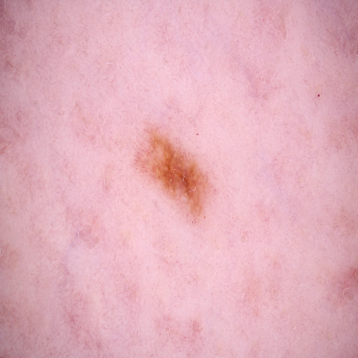
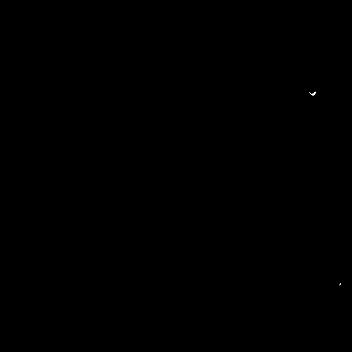

# DermoHairNet: U-Net Hair Artifact Segmentation for Dermoscopy

DermoHairNet is a deep learning and image processing project for segmenting and counting hair artifacts in dermoscopic skin images. The aim is to support melanoma image preprocessing by identifying hair obstruction in dermoscopy images and grouping images according to estimated hair count.

Hair artifacts can obscure lesion color, texture, and structure in dermoscopic images. This project addresses that preprocessing problem using a U-Net convolutional neural network for pixel-level hair segmentation and OpenCV contour analysis for hair counting.

> This repository is a research and educational project. It is not a medical diagnostic system and must not be used for clinical decision making.

## Project report

A detailed technical report is included here:

[View the DermoHairNet project report](docs/DermoHairNet_Research_Project_Report.pdf)

## Sample result

| Input dermoscopy image | Predicted hair mask |
|---|---|
|  |  |

## What this project does

The project pipeline contains five main stages:

1. **Image annotation**
   - Dermoscopy images were manually annotated using Label Studio.
   - The brush tool was used to mark visible hair pixels.
   - Masks were exported in PNG format.

2. **Preprocessing**
   - Input images were resized to 512 × 512 pixels.
   - Images were converted to grayscale.
   - Mask pixel values were converted into binary labels: background and hair.
   - Masks were encoded for two-class segmentation.

3. **Model training**
   - A U-Net CNN architecture was used for semantic segmentation.
   - The model learns pixel-level hair regions from annotated masks.
   - The model file is saved as `unet_512.h5`.

4. **Hair segmentation**
   - The trained model predicts hair masks on unseen dermoscopy images.
   - Predicted masks highlight hair-like structures in the image.

5. **Hair counting and classification**
   - OpenCV is used for binary thresholding, edge detection, and contour extraction.
   - The number of detected contours is used as an estimated hair count.
   - Images can be grouped into folders by hair count inside the `Classify` folder.

## Key results

- U-Net based hair segmentation for dermoscopic images
- Approximately 200 manually annotated images from an ISIC dataset context
- Reported test accuracy: approximately 98%
- Reported validation accuracy: approximately 97.5%
- Hair count classes: 0 hairs to 19 or more hairs
- Tools used: Python, Keras, TensorFlow, OpenCV, NumPy, Matplotlib, Label Studio

## Repository structure

```text
.
├── README.md
├── requirements.txt
├── .gitignore
├── LICENSE
├── segmentation.py
├── unet_hair.ipynb
├── unet_512.h5
├── temp.png
├── temp_mask.png
├── run_demo.py
├── run_batch_classification.py
├── docs/
│   └── DermoHairNet_Research_Project_Report.pdf
├── data/
│   ├── README.md
│   ├── images/
│   ├── masks/
│   └── Test/
├── Classify/
│   └── README.md
└── outputs/
```

## Files included in this repository

| File or folder | Purpose |
|---|---|
| `segmentation.py` | U-Net model architecture |
| `unet_hair.ipynb` | Original training and inference notebook |
| `unet_512.h5` | Saved trained model |
| `temp.png` | Example input image |
| `temp_mask.png` | Example predicted mask |
| `run_demo.py` | Simple script for running the trained model on one image |
| `run_batch_classification.py` | Optional script for grouping images by predicted hair count |
| `docs/` | Technical project report |
| `data/` | Local dataset placeholder |
| `Classify/` | Output placeholder for classified images |

## Dataset note

The full dermoscopy image dataset is not included in this repository because of size and dataset redistribution considerations. To retrain the model, place images and masks locally in the following folders:

```text
data/images/
data/masks/
```

For testing or batch classification, place input images in:

```text
data/Test/
```

The `Classify` folder is kept as an empty placeholder because the generated classified image folders can become very large.

## Installation

Create a Python environment and install the required packages:

```bash
pip install -r requirements.txt
```

## Run a demo prediction

Run the trained model on the included sample image:

```bash
python run_demo.py --image temp.png --model unet_512.h5 --output outputs
```

The script saves:

```text
outputs/temp_predicted_mask.png
outputs/temp_overlay.png
outputs/temp_hair_count_contours.png
```

It also prints the estimated hair count.

## Run batch classification

Place test images inside:

```text
data/Test/
```

Then run:

```bash
python run_batch_classification.py --input data/Test --model unet_512.h5 --output Classify --threshold 20
```

Images with 20 or more detected hair contours are grouped into:

```text
Classify/20_plus/
```

## Training workflow

To retrain the model, open:

```text
unet_hair.ipynb
```

The notebook includes:

- loading images and masks
- mask binarization
- train and validation split
- U-Net compilation and training
- loss and accuracy curves
- prediction visualization
- hair counting logic
- folder classification logic

## Skills demonstrated

- Computer vision
- Medical image preprocessing
- Semantic segmentation
- U-Net CNN architecture
- Data annotation with Label Studio
- Binary mask preprocessing
- OpenCV contour analysis
- Model validation and visualization
- Python based deep learning workflow

## Limitations and future work

This project was developed as a university research prototype. Future improvements may include:

- larger annotated training set
- stronger validation against expert manual counts
- transfer learning for dermoscopic image segmentation
- improved contour separation for overlapping hair strands
- inpainting-based hair removal after segmentation
- integration into a complete melanoma image preprocessing pipeline

## Author

Muhammad Adil Salam

Leibniz University Hannover  
Hannover Centre for Optical Technologies  
Project Thesis, 2022
